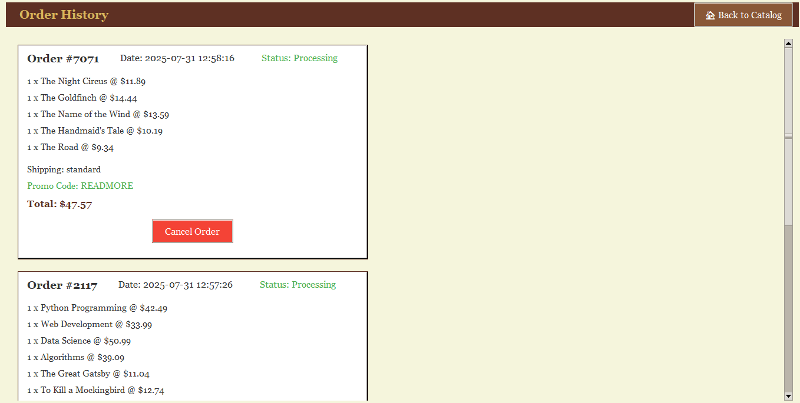

# 📚 KitabZone - Online Bookstore

## 📌 Project Overview
**KitabZone** is a fully functional **desktop-based E-Bookstore application** developed as part of a **Software Engineering course project** using **Python 3.14 and Tkinter GUI**.  
The application provides an interactive experience for customers to **browse, search, and purchase books**, while allowing administrators to **manage inventory, users, promotions, and sales reports** efficiently.

---

## 🚀 Key Features

### 1️⃣ User Management
- Secure **Login and Signup** system.
- **Role-based access control** (Customer/Admin).
- Safe **Logout** functionality.

---

### 2️⃣ Book Management
- Display books dynamically in grid layout.
- **Search** by title or author.
- **Filter books** by category (Programming, Novels, Science, etc.).
- **Admin tools** to add, update, or remove books from inventory.

---

### 3️⃣ Shopping Cart
- Add multiple books with quantity selection.
- Update or remove items from the cart.
- Apply **discount codes** (e.g., `DISCOUNT10`).
- Automatically calculate total price after discounts.

---

### 4️⃣ Order Management
- Place orders and confirm purchase.
- View **order history** for previous transactions.
- Cancel orders before they are processed.

---

### 5️⃣ Admin Dashboard
- Manage users (block, promote to admin).
- Create or remove promotional codes.
- Generate **sales reports** (orders, revenue, top sellers).

---

## 🛠 Tech Stack
- **Language:** Python 3.14+
- **GUI Framework:** Tkinter
- **Data Storage:** Local file-based database (upgradeable to MySQL/SQLite)
- **Version Control:** Git & GitHub

---

## 📂 Documentation & UML Diagrams
The project includes complete **Software Engineering documentation**:
- **Use Case Diagram** – User and admin interactions with the system.
- **Activity Diagram** – Workflow of major processes.
- **Class Diagram** – Main system classes and their relationships.
- **Sequence Diagram** – Order of operations between actors and system.
- **State Diagram** – Order lifecycle status changes.

All documents are available in:

 # 💻 UI Preview

